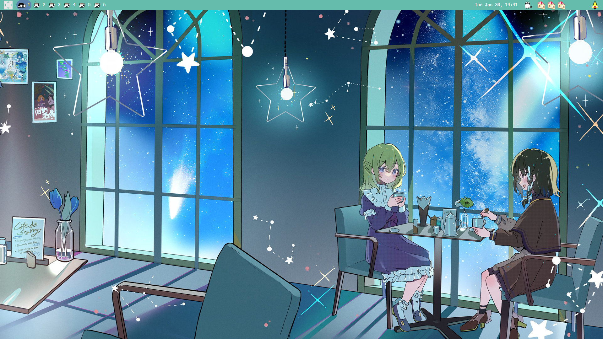

<h1 align='center'>Cafe de Starry</h1>

A mysterious cafe that appears only on starry nights. When you smell the sweet scent, take a sip and have a deep dream. In a world of countless twinkling stars, sip a cup of fantasy-colored tea.

Welcome to Cafe de Starry.

## Hello! :sparkles:
If you couldn't tell already, the short paragraph is most certainly a reference to something. 

As Cafe de Starry remains as one of my personal favourite from TUMENECO, what better way to appreciate it further by making a rice that's a direct reference to it!

So just take a seat, and enjoy your time reading through my config files! Owie watch your steps, the cat is sound asleep!

## Information
Here is my setup:
- **OS:** [Arch Linux](https://archlinux.org)  
- **WM:** [awesome](https://github.com/awesomeWM/awesome)  
- **Terminal:** [wezterm](https://github.com/wez/wezterm.git)  
- **Shell:** [bash](https://www.gnu.org/software/bash)  
- **Editor:** [neovim](https://github.com/neovim/neovim)  
- **Compositor:** [picom](https://github.com/yshui/picom)  
- **Application Launcher:** [rofi](https://github.com/davatorium/rofi)  
- **File Manager:** [ranger](https://github.com/ranger/ranger)

AwesomeWM modules used:
- **[lain](https://github.com/lcpz/lain)**
- **[bling](https://github.com/BlingCorp/bling.git)**

The cutes of this rice:
- Cat
    - It wakes up or sleep depending on the time of the day
    - Wakes up at its sleeping state when mouse hovers over it
    - It's a cat!
- Cake battery indicator
    - Indicates battery using amount of cakes
- Bell
    - Shows a ringing sprite when hovered over it
    - Opens popup panel
- Turntable music widget
    - Music indicator
- Custom taglist icons

External dependencies:
- **[playerctl](https://github.com/altdesktop/playerctl.git)**
- **[brightnessctl](https://github.com/Hummer12007/brightnessctl.git)**
